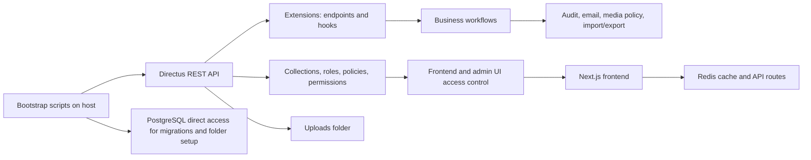
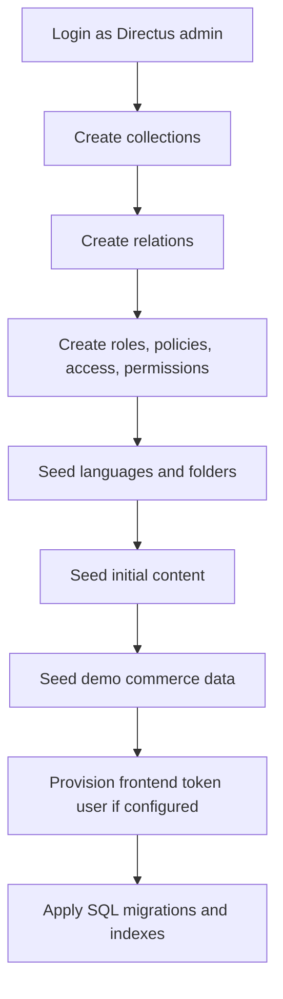
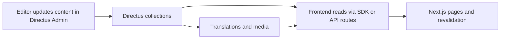
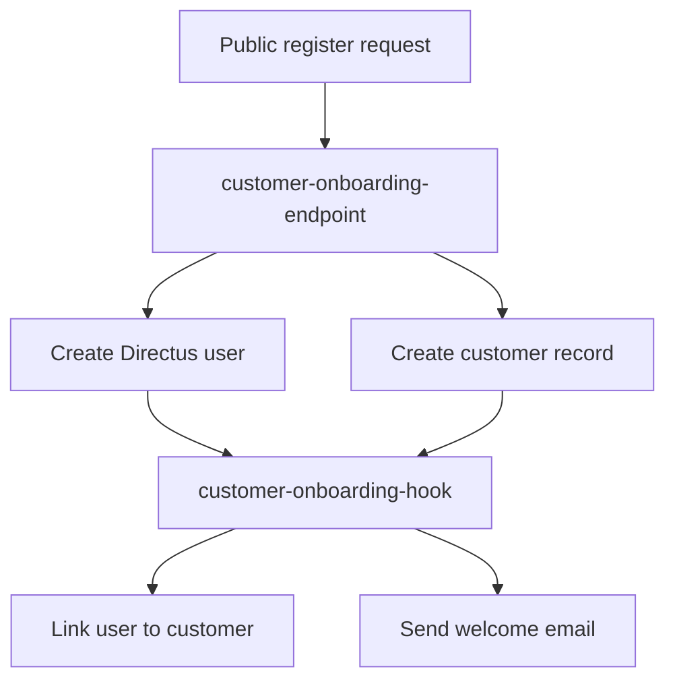
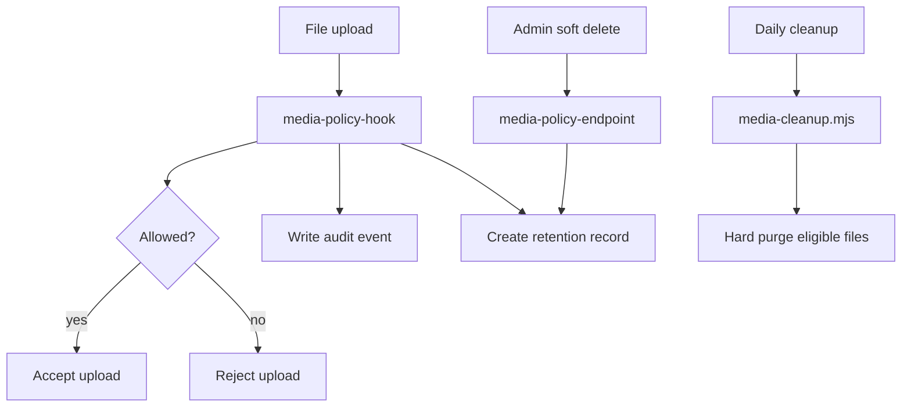
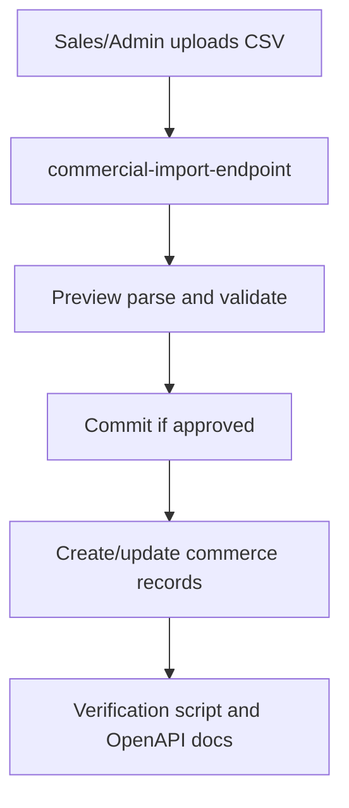

# Directus Folder Overview

This folder is the configuration and extension layer for the ULink Directus
instance. It is not a fork of Directus. The official `directus/directus:11`
image still provides the CMS runtime, auth, RBAC engine, REST/GraphQL API, and
admin UI.

Use this document as the quickest way to understand:

- what each folder does,
- how bootstrap works,
- how the data and business flows connect,
- where to look first when you need to change something.

## Mental Model

Think of `directus/` as five layers:

1. **Bootstrap** - creates and keeps the Directus instance aligned with code.
2. **Schema and RBAC** - defines collections, relations, roles, policies, and permissions.
3. **Shared libraries** - reusable helpers used by bootstrap and extensions.
4. **Custom extensions** - business logic that Directus does not provide out of the box.
5. **Seed, migrations, and tests** - initial content, SQL hardening, and verification.

If you understand those five layers, you understand the folder.

## Runtime Architecture

High-level flow:

1. Docker starts Directus, Postgres, and Redis.
2. `bootstrap.mjs` logs in as admin and applies schema, RBAC, seed data, and SQL migrations.
3. Directus serves content and business APIs.
4. Custom extensions handle onboarding, media policy, commercial import, and docs.
5. The frontend reads from Directus and uses its own API routes for caching and orchestration.

## Directory Map

### Top-level files

- `bootstrap.mjs`
  - Main idempotent setup script.
  - Creates collections, relations, roles, policies, access links, permissions, languages, folders, seed data, and DB indexes.
- `package.json`
  - NPM scripts for bootstrap, verification, RBAC checks, OpenAPI export, media cleanup, and extension build copying.
- `Dockerfile`
  - Container image definition for the Directus service.
- `uploads/`
  - Mounted media storage for real uploaded files.
- `docs/`
  - Human-readable explanation of schema, testing, and API behavior.

### `schema/`

This is the data model source of truth.

- `collections.mjs`
  - Declares every custom collection and singleton created during bootstrap.
  - Defines fields, UI metadata, status fields, SEO fields, and hidden junction collections.
- `relations.mjs`
  - Declares all relationships between collections.
  - Includes one-to-many, many-to-one, and junction-side relation definitions.

Read this folder when you want to know:

- what tables exist,
- how content relates,
- which fields are canonical,
- which collections are translation-enabled.

### `rbac/`

This is the access-control model.

- `roles.mjs`
  - Declares the managed roles: Administrator, Editor, Sales, Customer, Visitor.
- `policies.mjs`
  - Declares policies that map to admin access or app access.
- `access.mjs`
  - Links roles to policies.
- `permissions.mjs`
  - Declares collection-level and row-level permissions.
  - This is the most important file when debugging "why can this role do that?"

Read this folder when you want to know:

- who can read or write a collection,
- which rows a customer can see,
- which actions are public,
- how Directus access is expected to behave.

### `lib/`

Shared utilities used across bootstrap and extensions.

- `ensure-helpers.mjs`
  - Idempotent wrappers around Directus SDK operations.
  - Handles create-or-update behavior, stale cleanup, and consistent logging.
- `media-policy.mjs`
  - Central media rules: allowed file types, size limits, folder mapping, retention logic.
- `i18n.mjs`
  - Locale definitions and translation collection helpers.
- `folder-db.mjs`
  - Low-level Postgres helper for folder/file setup during bootstrap.
- `db-indexes.mjs`
  - Applies raw SQL migrations after Directus schema setup.
- `smtp.mjs`
  - Thin email transport helper used by onboarding and related flows.
- `config.mjs`
  - Directus client setup and admin login wiring.
- `constants.mjs`
  - Stable UUIDs and reusable constants.

Read this folder when you want to understand:

- how bootstrap stays idempotent,
- how media policy is enforced,
- how translations are provisioned,
- how mail and DB-level helpers are shared.

### `extensions/`

Custom Directus extensions. These are the business workflows that sit on top of the CMS.

- `commercial-import-endpoint/`
  - CSV preview and commit endpoints for commerce data.
  - Used by admin and sales workflows.
- `customer-onboarding-endpoint/`
  - Public registration flow for customer self-signup.
- `customer-onboarding-hook/`
  - Links a newly created Directus user to a matching customer record.
- `media-policy-hook/`
  - Enforces upload rules, writes audit events, and manages retention state.
- `media-policy-endpoint/`
  - Admin-facing soft-delete and hard-delete actions for uploaded files.
- `docs-endpoint/`
  - Serves merged API documentation for core Directus APIs and custom endpoints.
- `otp-endpoint/`
  - OTP-related auth support.
- `password-change-endpoint/`
  - Password change flow for authenticated users.
- `password-reset-request-endpoint/`
  - Public password reset request flow.
- `password-policy-hook/`
  - Enforces password rules.
- `security-headers-hook/`
  - Adds security headers at the Directus layer.

Read this folder by business flow, not alphabetically:

1. onboarding
2. media governance
3. commercial import
4. auth and password flows
5. docs and ops helpers

### `seed/`

Initial and demo content used after schema creation.

- `initial_content.mjs`
  - Seeds core taxonomy, content, products, hubs, and baseline portal records.
- `demo_commerce.mjs`
  - Seeds sample commerce records for portal and operational testing.
- `translation_data.mjs`
  - Locale-specific source strings for seeded content.
- `rbac_seed.mjs`
  - Helper seed data related to access and role setup.

Read this folder when you want to know:

- what the instance should contain after first bootstrap,
- which sample content exists for testing,
- how translations are populated.

### `sql/migrations/`

Raw SQL executed after Directus schema creation.

Current use cases:

- query performance indexes,
- case-insensitive SKU uniqueness,
- commercial import support indexes,
- ERP outbox reporting view.

Read this folder when you want to understand:

- why a query is fast,
- why a uniqueness rule exists at the database layer,
- which Directus limitations are intentionally bypassed with SQL.

### `testing/`

Executable verification scripts.

- `verify_bootstrap.mjs`
  - Confirms the bootstrap baseline is correct.
- `rbac_verify.mjs`
  - Checks role and permission behavior.
- `verify_onboarding.mjs`
  - Tests customer registration and linking behavior.
- `verify_commercial_data_import.mjs`
  - Tests CSV preview and commit import flows.
- `verify_media_policy.mjs`
  - Tests upload restrictions and media retention.
- `verify_erp_outbound_webhook.mjs`
  - Tests ERP outbox and webhook behavior.
- `verify_password_reset.mjs`
- `verify_password_change.mjs`
- `verify_newsletter_subscription.mjs`
- `verify_rfq_notification_flow.mjs`
- `verify_sku_cache_hook.mjs`
- `api_test_samples.json`
  - Example payloads used by tests and docs.

Read this folder when you want to confirm behavior instead of guessing.

### `scripts/`

Operational helpers and generated artifacts.

- `openapi_export.mjs`
  - Exports merged OpenAPI for Directus core and custom endpoints.
- `media-cleanup.mjs`
  - Runs retention cleanup logic.
- `inspect_roles.mjs`
  - Prints or inspects managed roles and access structure.

### `docs/`

Directus-specific documentation.

- `SCHEMA.md`
  - Human-readable contract for collections, relations, RBAC, enums, media policy, i18n, and ERP fields.
- `SCHEMA_VI.md`
  - Vietnamese translation of the schema document.
- `overview.md`
  - This document (English version).
- `TONG_QUAN.md`
  - Vietnamese overview document.
- `API_TESTING_GUIDE.md`
  - Copy-paste testing instructions for custom endpoints.
- `HUONG_DAN_TEST_API.md`
  - Vietnamese API testing guide.
- `api_operations_list.txt`
  - Endpoint inventory.

## Main Flows

### 1. Bootstrap flow

This is the order in `bootstrap.mjs`. If something is missing in Directus after a reset, this is the file to inspect first.

### 2. Content delivery flow

This is the content loop for marketing pages, product pages, and localized content.

### 3. Customer onboarding flow

This flow is the canonical example of "endpoint + hook + shared library" working together.

### 4. Media governance flow

This is the best example of policy enforcement being handled in more than one place on purpose.

### 5. Commercial import flow

Use this flow when investigating bulk import issues or row-matching behavior.

## What To Read First

If you are new to the folder, read in this order:

1. `docs/SCHEMA.md`
2. `bootstrap.mjs`
3. `schema/collections.mjs`
4. `schema/relations.mjs`
5. `rbac/permissions.mjs`
6. `lib/ensure-helpers.mjs`
7. `extensions/customer-onboarding-endpoint/src/index.js`
8. `extensions/media-policy-hook/src/index.js`
9. `extensions/commercial-import-endpoint/src/index.js`
10. `testing/verify_bootstrap.mjs`

That sequence gives you the fastest path from "what exists" to "how it behaves".

## Change Rules

When you modify this folder:

- update `SCHEMA.md` if schema or RBAC behavior changes,
- update the relevant verification script if behavior changes,
- update `API_TESTING_GUIDE.md` if endpoint inputs or outputs change,
- keep bootstrap idempotent,
- avoid manual drift in the Directus UI for managed objects.

## Summary

The shortest accurate description of this folder is:

- `schema/` defines the data model,
- `rbac/` defines access,
- `lib/` defines shared mechanics,
- `extensions/` defines business behavior,
- `seed/` defines the starting content,
- `sql/migrations/` defines DB-level hardening,
- `testing/` defines behavior checks,
- `bootstrap.mjs` ties it all together.

If you want to understand the repo, start from `SCHEMA.md`, then follow the flows above.
