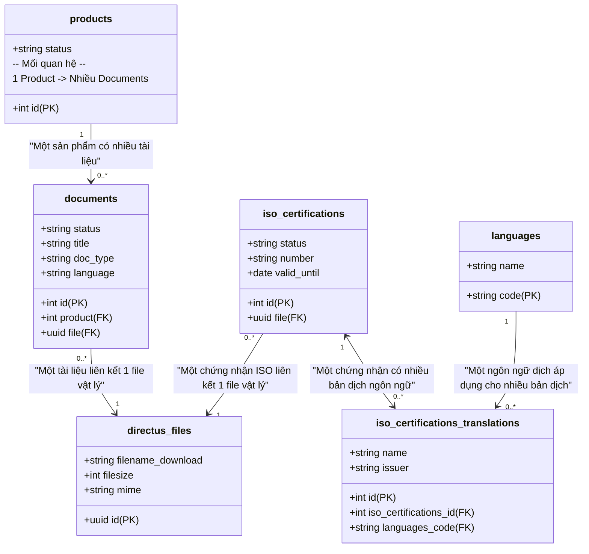

# Thiết Kế Quan Hệ Cơ Sở Dữ Liệu - Resource Center & ISO Certifications

Tài liệu này mô tả chi tiết thiết kế và sơ đồ quan hệ thực thể (ERD) giữa các bảng liên quan đến tính năng quản lý, tải xuống tài liệu kỹ thuật công khai (Technical Documents) và chứng nhận ISO (ISO Certifications) trong hệ thống ULink B2B Platform.

---

## 1. Sơ đồ quan hệ thực thể (ERD)

---

## 2. Mô tả Chi tiết các Mối quan hệ

### 2.1. Nhóm Tài liệu kỹ thuật (`documents`)
* **`documents` (Nhiều) $\rightarrow$ `products` (Một) (Many-to-One):**
  * Liên kết qua trường `product` của bảng `documents` tham chiếu tới khóa chính `id` của bảng `products` (Định nghĩa tại [relations.mjs](file:///c:/Users/thanh/Desktop/PathtechProject/ulink-b2b-platform/directus/schema/relations.mjs#L7)).
  * *Ý nghĩa:* Một sản phẩm có thể đi kèm với nhiều loại tài liệu kỹ thuật khác nhau (như bản TDS, MSDS, Brochure hướng dẫn, hoặc chứng chỉ chất lượng sản phẩm). Ngược lại, một tài liệu kỹ thuật chỉ thuộc về một sản phẩm duy nhất.
* **`documents` (Nhiều) $\rightarrow$ `directus_files` (Một) (Many-to-One):**
  * Liên kết qua trường `file` (kiểu dữ liệu UUID) tham chiếu tới bảng hệ thống quản lý tệp tin `directus_files` (Định nghĩa tại [relations.mjs](file:///c:/Users/thanh/Desktop/PathtechProject/ulink-b2b-platform/directus/schema/relations.mjs#L8)).
  * *Ý nghĩa:* Lưu trữ đường dẫn tệp tin thực tế giúp người dùng bấm vào là có thể tải trực tiếp file PDF/Word/Excel về máy.

### 2.2. Nhóm Chứng nhận ISO (`iso_certifications`)
* **`iso_certifications` (Nhiều) $\rightarrow$ `directus_files` (Một) (Many-to-One):**
  * Liên kết qua trường `file` (UUID) tham chiếu tới `directus_files`.
  * *Ý nghĩa:* Mỗi chứng chỉ ISO công khai sẽ có một file scan (thường là PDF) đính kèm để khách hàng xem hoặc tải về máy tính làm minh chứng pháp lý.
* **`iso_certifications` (Một) $\leftrightarrow$ `iso_certifications_translations` (Nhiều) (One-to-Many / Bidirectional):**
  * Đây là cơ chế đa ngôn ngữ tự động của Directus (Được xây dựng động từ các cấu hình trong [i18n.mjs](file:///c:/Users/thanh/Desktop/PathtechProject/ulink-b2b-platform/directus/lib/i18n.mjs#L159-L209)).
  * Bảng trung gian `iso_certifications_translations` sẽ chứa khóa ngoại `iso_certifications_id` trỏ về bảng cha, và khóa ngoại `languages_code` trỏ về bảng ngôn ngữ `languages`.
  * *Ý nghĩa:* Tên chứng nhận (`name`) và đơn vị cấp (`issuer`) có thể hiển thị linh hoạt theo ngôn ngữ hiện tại của người dùng trên website (Tiếng Việt, Tiếng Anh, hoặc Tiếng Nhật).

---

## 3. Cấu hình schema trong Source Code
* Thiết lập collection và các trường dữ liệu: [collections.mjs](file:///c:/Users/thanh/Desktop/PathtechProject/ulink-b2b-platform/directus/schema/collections.mjs)
* Thiết lập quan hệ khóa ngoại (Foreign Keys): [relations.mjs](file:///c:/Users/thanh/Desktop/PathtechProject/ulink-b2b-platform/directus/schema/relations.mjs)
* Thiết lập bản dịch đa ngôn ngữ: [i18n.mjs](file:///c:/Users/thanh/Desktop/PathtechProject/ulink-b2b-platform/directus/lib/i18n.mjs)
