# Sơ đồ Quan hệ Thực thể (Entity-Relationship Diagram - ERD)

Tài liệu này mô tả chi tiết sơ đồ quan hệ thực thể (ERD) của hệ thống **ULink B2B Platform** được quản lý bởi Directus (PostgreSQL). Bản thiết kế này được biểu diễn dưới dạng biểu đồ [Mermaid](https://mermaid.js.org/) để hiển thị trực quan trong các trình đọc Markdown hỗ trợ.

---

## 1. Sơ đồ ERD Tổng quan

```mermaid
erDiagram
    %% ==========================================
    %% SYSTEM COLLECTIONS (DIRECTUS NATIVE)
    %% ==========================================
    directus_users {
        uuid id PK
        string email
        string password
        string first_name
        string status
    }

    directus_files {
        uuid id PK
        string filename_download
        string mime
        int filesize
    }

    %% ==========================================
    %% B2B PORTAL COLLECTIONS
    %% ==========================================
    customers {
        int id PK
        string status "active | inactive"
        uuid user FK
        string company_name
        string tax_code
        string contact_name
        string email
        string phone
        string address
        uuid sales_owner FK
    }

    orders {
        int id PK
        string status "pending | confirmed | processing | shipped | completed | cancelled"
        string code
        int customer FK
        datetime order_date
        int hub FK
        decimal subtotal
        decimal tax
        decimal total
        string notes
        string erp_ref
    }

    order_items {
        int id PK
        int order FK
        int sku FK
        string description
        int qty
        decimal unit_price
        decimal line_total
    }

    invoices {
        int id PK
        string code
        int customer FK
        int order FK
        datetime issue_date
        datetime due_date
        decimal amount
        decimal paid_amount
        decimal balance
        string paid_status "unpaid | partial | paid | overdue"
        string erp_ref
    }

    deliveries {
        int id PK
        int order FK
        int hub FK
        datetime scheduled_date
        datetime delivered_date
        string status "scheduled | in_transit | delivered | late | cancelled"
        string tracking_ref
        string erp_ref
    }

    rfq_requests {
        int id PK
        string company
        string contact_name
        string email
        string phone
        string industry
        int hub FK
        json line_items
        string message
        string status "new | quoted | won | lost"
        uuid assigned_sales FK
        string source "web | portal"
        uuid user FK
    }

    regional_hubs {
        int id PK
        string name
        string slug
        string delivery_sla
        string warehouse_capacity
        string technical_team
        string cluster_overview
        string location
        string coordinates
        string status
    }

    %% ==========================================
    %% CATALOG & PRODUCT COLLECTIONS
    %% ==========================================
    product_categories {
        int id PK
        string name
        string slug
        int parent FK
        string description
        uuid hero_image FK
        int sort
        string status
    }

    products {
        int id PK
        string name
        string slug
        int category FK
        string short_description
        json specifications
        uuid hero FK
        string status
        string meta_title
        string meta_description
    }

    product_skus {
        int id PK
        string sku_code
        int product FK
        string unit
        string pack_size
        json attributes
        string status
    }

    documents {
        int id PK
        string title
        string doc_type "tds | msds | certificate | brochure"
        int product FK
        uuid file FK
        string language
        string status
    }

    industries {
        int id PK
        string name
        string slug
        string description
        string icon
        string status
    }

    %% ==========================================
    %% CONTENT & MARKETING COLLECTIONS
    %% ==========================================
    blog_posts {
        int id PK
        string title
        string slug
        string body
        uuid cover FK
        uuid author FK
        datetime published_at
        string status
        string meta_title
        string meta_description
    }

    case_studies {
        int id PK
        string title
        string slug
        string summary
        string body
        int industry FK
        uuid cover FK
        string status
    }

    iso_certifications {
        int id PK
        string name
        string number
        string issuer
        date valid_until
        uuid file FK
        string status
    }

    pages {
        int id PK
        string title
        string slug
        string body
        string status
        string meta_title
        string meta_description
    }

    hero_banners {
        int id PK
        string title
        string subtitle
        uuid image FK
        string cta_label
        string cta_url
        int sort
        string status
    }

    partners {
        int id PK
        string name
        uuid logo FK
        string url
        int sort
        string status
    }

    integration_events {
        int id PK
        string entity
        string op
        string record_id
        string erp_ref
        string revision
        string idempotency_key
        json payload
        string status
        int attempts
        datetime next_attempt_at
        datetime last_attempt_at
        int last_status_code
        string last_error
        string destination_url
    }

    %% ==========================================
    %% JUNCTION TABLES (MANY-TO-MANY)
    %% ==========================================
    products_industries {
        int products_id FK
        int industries_id FK
    }

    products_files {
        int products_id FK
        uuid directus_files_id FK
    }

    %% ==========================================
    %% RELATIONSHIPS DEFINITION
    %% ==========================================

    %% Native Identity & Core
    directus_users ||--o| customers : "user identity (1:1/0)"
    directus_users ||--o{ customers : "manages (sales owner)"
    directus_users ||--o{ rfq_requests : "creates (portal-origin user)"
    directus_users ||--o{ rfq_requests : "assigned sales owner"
    directus_users ||--o{ blog_posts : "author"

    %% File Attachments
    directus_files ||--o{ product_categories : "hero image"
    directus_files ||--o{ products : "hero image"
    directus_files ||--o{ documents : "attachment"
    directus_files ||--o{ blog_posts : "cover image"
    directus_files ||--o{ case_studies : "cover image"
    directus_files ||--o{ iso_certifications : "cert pdf"
    directus_files ||--o{ hero_banners : "banner image"
    directus_files ||--o{ partners : "logo image"

    %% B2B Portal Relations
    customers ||--o{ orders : "places"
    customers ||--o{ invoices : "owns"
    
    orders ||--|{ order_items : "contains"
    orders ||--o| invoices : "billed by"
    orders ||--o{ deliveries : "shipped by"

    regional_hubs ||--o{ orders : "fulfills"
    regional_hubs ||--o{ deliveries : "ships from"
    regional_hubs ||--o{ rfq_requests : "preferred hub"

    %% Catalog Hierarchy & Skus
    product_categories ||--o| product_categories : "sub-category (parent self-ref)"
    product_categories ||--o{ products : "categorizes"
    products ||--|{ product_skus : "has skus"
    products ||--o{ documents : "has docs (TDS/MSDS)"
    
    product_skus ||--o{ order_items : "ordered item"

    %% Case Studies & Industries
    industries ||--o{ case_studies : "referenced industry"

    %% Junction Tables Relationships
    products ||--|{ products_industries : "tagged with"
    industries ||--|{ products_industries : "tags"

    products ||--|{ products_files : "gallery has"
    directus_files ||--|{ products_files : "gallery uses"
```

---

## 2. Chi tiết các Phân nhóm Dữ liệu & Mối liên hệ (Domain Modules & Relationships)

### A. Phân hệ Hệ thống & Danh tính (Identity & Core System)
Quản lý tài khoản và tệp tin đa phương tiện toàn hệ thống:
*   [directus_users](../../directus/SCHEMA.md#L18): Lưu trữ thông tin tài khoản đăng nhập (email, mật khẩu băm, họ tên, trạng thái) của Admin, nhân viên Sales, và khách hàng (Customer).
*   [directus_files](../../directus/SCHEMA.md#L18): Quản lý tập trung thông tin tệp tin, hình ảnh, tài liệu kỹ thuật được tải lên hệ thống.
*   **Mối liên hệ:**
    *   `directus_files` đóng vai trò nguồn lưu trữ tài nguyên đa phương tiện (avatar, ảnh sản phẩm, file PDF) cho toàn bộ các thực thể khác thông qua khóa ngoại kiểu UUID.

### B. Phân hệ Portal B2B (B2B Portal Modules)
Các thực thể phục vụ luồng mua hàng, công nợ và giao vận của khách hàng doanh nghiệp:
*   [customers](../../directus/SCHEMA.md#L60): Lưu trữ hồ sơ doanh nghiệp khách hàng (tên công ty, mã số thuế, địa chỉ nhận hàng, thông tin liên hệ).
    *   **Mối liên hệ:** 
        *   `user` (m2o sang `directus_users`): Liên kết định danh tài khoản đăng nhập (quan hệ 1:1/0).
        *   `sales_owner` (m2o sang `directus_users`): Xác định nhân sự Sales phụ trách quản lý khách hàng doanh nghiệp này.
*   [orders](../../directus/SCHEMA.md#L61): Lưu trữ thông tin đơn hàng tổng quát (mã đơn, ngày đặt, tổng tiền, thuế, ghi chú, trạng thái).
    *   **Mối liên hệ:**
        *   `customer` (m2o sang `customers`): Xác định đơn hàng thuộc về khách hàng nào.
        *   `hub` (m2o sang `regional_hubs`): Đơn vị chịu trách nhiệm xử lý/giao vận đơn hàng này.
*   [order_items](../../directus/SCHEMA.md#L62): Chi tiết từng mặt hàng trong đơn hàng.
    *   **Mối liên hệ:**
        *   `order` (m2o sang `orders`): Thuộc đơn hàng tổng nào.
        *   `sku` (m2o sang `product_skus`): SKU sản phẩm cụ thể được mua.
*   [invoices](../../directus/SCHEMA.md#L63): Quản lý công nợ và hóa đơn tài chính của khách hàng.
    *   **Mối liên hệ:**
        *   `customer` (m2o sang `customers`): Người sở hữu hóa đơn.
        *   `order` (m2o sang `orders`): Hoá đơn xuất cho đơn hàng cụ thể nào.
*   [deliveries](../../directus/SCHEMA.md#L64): Lịch trình vận chuyển và trạng thái giao hàng thực tế.
    *   **Mối liên hệ:**
        *   `order` (m2o sang `orders`): Đơn hàng cần giao.
        *   `hub` (m2o sang `regional_hubs`): Giao hàng xuất phát từ hub/kho nào.
*   [rfq_requests](../../directus/SCHEMA.md#L65): Yêu cầu báo giá từ khách hàng doanh nghiệp hoặc khách vãng lai.
    *   **Mối liên hệ:**
        *   `user` (m2o sang `directus_users`): Liên kết với tài khoản khách hàng nếu họ đã đăng nhập.
        *   `assigned_sales` (m2o sang `directus_users`): Nhân sự Sales được giao xử lý báo giá.
        *   `hub` (m2o sang `regional_hubs`): Hub phụ trách gần nhất được ưu tiên xử lý.
*   [regional_hubs](../../directus/SCHEMA.md#L31): Quản lý thông tin các kho hàng, cam kết SLA vận chuyển, tọa độ và khu vực hoạt động của hub.

### C. Phân hệ Danh mục & Sản phẩm (Catalog & Product Modules)
Quản lý vòng đời sản phẩm hóa chất và các tài liệu kỹ thuật liên quan:
*   [product_categories](../../directus/SCHEMA.md#L27): Danh mục sản phẩm theo cây phân cấp.
    *   **Mối liên hệ:**
        *   `parent` (m2o self-referencing sang `product_categories`): Tạo cấu trúc cây phân cấp danh mục cha - con.
        *   `hero_image` (m2o sang `directus_files`): Ảnh bìa danh mục.
*   [products](../../directus/SCHEMA.md#L28): Thông tin sản phẩm cốt lõi (tên, mô tả, thông số kỹ thuật dạng JSON).
    *   **Mối liên hệ:**
        *   `category` (m2o sang `product_categories`): Thuộc danh mục sản phẩm nào.
        *   `hero` (m2o sang `directus_files`): Ảnh đại diện chính cho sản phẩm.
*   [product_skus](../../directus/SCHEMA.md#L29): Quy cách đóng gói/đơn vị SKU thực tế để bán (ví dụ: Bao 25kg, Phuy 200L).
    *   **Mối liên hệ:**
        *   `product` (m2o sang `products`): Thuộc dòng sản phẩm gốc nào.
*   [documents](../../directus/SCHEMA.md#L30): Lưu trữ tài liệu kỹ thuật bắt buộc của ngành hóa chất (TDS, MSDS, Certificate).
    *   **Mối liên hệ:**
        *   `product` (m2o sang `products`): Tài liệu này thuộc sản phẩm nào.
        *   `file` (m2o sang `directus_files`): File PDF tài liệu được đính kèm.
*   [industries](../../directus/SCHEMA.md#L32): Các lĩnh vực/ngành công nghiệp ứng dụng sản phẩm (ví dụ: Dệt nhuộm, Xử lý nước, Thực phẩm).
*   **Các bảng trung gian (Junction Tables):**
    *   `products_industries` (m2m giữa `products` và `industries`): Liên kết một sản phẩm ứng dụng trong nhiều ngành công nghiệp và ngược lại.
    *   `products_files` (m2m giữa `products` và `directus_files`): Danh sách album ảnh (gallery) chi tiết cho sản phẩm.

### D. Các thực thực thể Nội dung & Marketing (Content & Utility Modules)
*   [blog_posts](../../directus/SCHEMA.md#L33): Tin tức, bài viết.
    *   **Mối liên hệ:** `author` (m2o sang `directus_users`) & `cover` (m2o sang `directus_files`).
*   [case_studies](../../directus/SCHEMA.md#L34): Dự án thực tế tiêu biểu ứng dụng sản phẩm.
    *   **Mối liên hệ:** `industry` (m2o sang `industries`) & `cover` (m2o sang `directus_files`).
*   [iso_certifications](../../directus/SCHEMA.md#L35): Các chứng chỉ ISO của công ty.
    *   **Mối liên hệ:** `file` (m2o sang `directus_files`).
*   [pages](../../directus/SCHEMA.md#L36): Nội dung các trang tĩnh như Giới thiệu, Điều khoản dịch vụ.
*   [hero_banners](../../directus/SCHEMA.md#L25) & [partners](../../directus/SCHEMA.md#L26): Banner quảng cáo trang chủ và thông tin đối tác chiến lược.

---

## 3. Các Ràng buộc Đặc biệt cần Lưu ý

1.  **Quan hệ 1-1 giữa User và Customer:**
    *   Mỗi tài khoản khách hàng (`directus_users`) chỉ liên kết với tối đa 1 bản ghi khách hàng doanh nghiệp (`customers`) thông qua trường `user`.
2.  **Khóa ngoại tự tham chiếu (Self-referencing FK):**
    *   `product_categories.parent` liên kết ngược lại khóa chính `id` của chính bảng `product_categories` để dựng cấu trúc cây danh mục nhiều cấp.
3.  **Trạng thái Tự đăng ký & Duyệt:**
    *   Khi khách hàng tự đăng ký thông qua endpoint onboarding, hệ thống tạo `directus_users` với trạng thái `active` giúp họ đăng nhập được ngay, nhưng tạo `customers` ở trạng thái `inactive`. Sau khi đội ngũ Sales kiểm tra thông tin doanh nghiệp hợp lệ, họ sẽ chuyển `customers.status` sang `active` trên trang quản trị.
4.  **Idempotent ERP Integration:**
    *   Các bảng `orders`, `invoices`, và `deliveries` đều chứa trường `erp_ref` (nullable, unique) để làm điểm neo đồng bộ dữ liệu hai chiều với hệ thống ERP bên ngoài nhằm tránh trùng lặp bản ghi.
