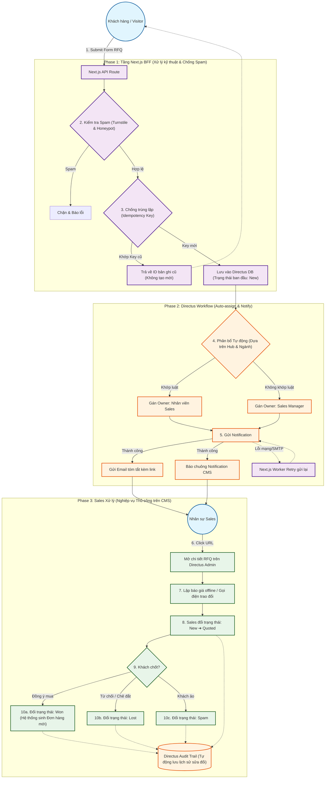

# Sơ đồ Luồng xử lý Báo giá (RFQ Lifecycle)

Dưới đây là sơ đồ chi tiết luồng dữ liệu từ lúc Khách hàng ấn gửi Yêu cầu Báo giá (UC-12) cho đến khi Sales chốt đơn thành công/thất bại (UC-13).

## Chú giải sơ đồ (Phục vụ cho Tester/QA):

Sơ đồ này vẽ ra **3 cụm test lớn** mà QA phải chuẩn bị kịch bản (Test Cases):

1. **Cụm Màu Tím (Phase 1):** Phải test khả năng **Chống Spam** (Cố tình vượt Turnstile) và **Chống trùng lặp** (Cố tình bấm Submit 2 lần liên tục với cùng email và thông tin đơn hàng). Yêu cầu hệ thống không được sập, không được báo lỗi 409 mà phải trả về thành công dù chỉ tạo 1 bản ghi.
2. **Cụm Màu Cam (Phase 2):** Phải test luật **Auto-Assign**. Đóng vai khách ở "Hub Miền Nam" + "Ngành Thực phẩm", sau đó kiểm tra xem tài khoản Sales phụ trách mảng đó có nhận được Chuông thông báo và Email không. Phải test thử ngắt kết nối mạng (hoặc điền sai SMTP) xem hệ thống có Retry lại việc gửi email không.
3. **Cụm Màu Xanh Lá (Phase 3):** Phải test **Phân quyền thao tác**. Đảm bảo Sales chỉ được quyền đổi trạng thái từ `New` sang `Quoted`, `Won`, `Lost`. Đảm bảo hệ thống có sinh ra log Audit Trail ghi nhận chính xác thời gian Sales đổi trạng thái. Đảm bảo bản ghi Đơn hàng được tạo ra khi chuyển sang `Won` sẽ hiển thị đúng lên Cổng B2B của tài khoản Customer tương ứng.
